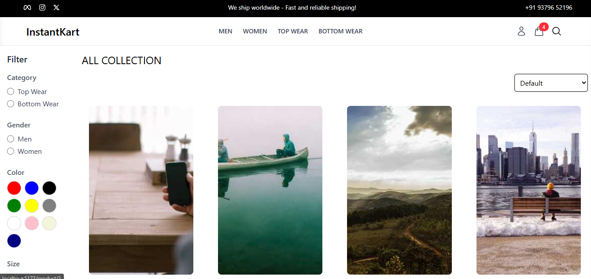
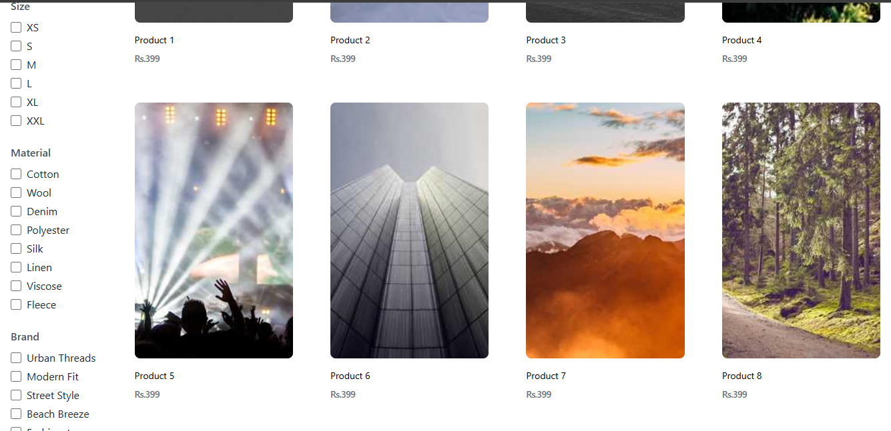

# 🛒 An InstantKart - E-Commerce Website

A fully responsive frontend-only e-commerce web application built using **React**, **Redux** for state management, **Tailwind CSS** for styling, and integrated with **PayPal** for dummy payment flow.

This project simulates a modern shopping platform UI with cart functionality, product detail views, and a realistic checkout experience.

---

## 🔥 Features

### 🧑‍💻 User-Facing Features 
- Home page with product highlights
- Product listing with categories
- Product detail page with image, description, and price
- Add to Cart 
- Login and Register
- Cart quantity management
- Checkout page with PayPal dummy payment integration
- Order summary
- Responsive design for all devices
- Product filtering/search functionality

### ⚙️ Technical Highlights
- React functional components with hooks
- Redux for global state (cart management)
- Tailwind CSS for fast and modern styling
- React Router for navigation
- PayPal dummy payment button integration
- LocalStorage used to persist cart items

---

## 🛠 Tech Stack

| Technology      | Description                             |
|----------------|-----------------------------------------|
| React           | UI library                              |
| Redux           | State management                        |
| Tailwind CSS    | Utility-first CSS framework             |
| React Router    | Client-side routing                     |
| PayPal Buttons  | For integrating a payment simulation    |
| LocalStorage    | Cart data persistence                   |

---

## 📦 Folder Structure
ecommerce-frontend/
├── public/ # Static public assets
├── src/ # Main source code
│
│ ├── assets/ # Images, icons, etc.
│
│ ├── components/ # Reusable components
│ │
│ │ ├── Admin/ # Admin-specific components/pages
│ │ │ ├── AdminLayout.jsx
│ │ │ ├── AdminSidebar.jsx
│ │ │ ├── EditProductPage.jsx
│ │ │ ├── OrderManagement.jsx
│ │ │ ├── ProductManagement.jsx
│ │ │ └── UserManagement.jsx
│
│ ├── pages/ # Main route pages for users
│ │ ├── AdminHomePage.jsx
│ │ ├── CollectionPage.jsx
│ │ ├── Home.jsx
│ │ ├── Login.jsx
│ │ ├── MyOrdersPage.jsx
│ │ ├── OrderConfirmationPage.jsx
│ │ ├── OrderDetailsPage.jsx
│ │ ├── Profile.jsx
│ │ └── Register.jsx
│
│ ├── common/ # Shared layout/UI components
│ │ ├── Footer.jsx
│ │ ├── Header.jsx
│ │ ├── Navbar.jsx
│ │ └── SearchBar.jsx
│
│ ├── Layout/ # Layout components for users/admin
│ │ ├── CartDrawer.jsx
│ │ ├── Topbar.jsx
│ │ └── UserLayout.jsx
│
│ ├── products/ # Product display-related components
│ │ ├── FeaturedSection.jsx
│ │ ├── FeatureCollection.jsx
│ │ ├── FilterSidebar.jsx
│ │ ├── HeaderCollectionSection.jsx
│ │ ├── NewArrivals.jsx
│ │ ├── ProductDetails.jsx
│ │ ├── ProductGrid.jsx
│ │ └── SortOptions.jsx
│
│ ├── redux/ # Redux setup
│ │ ├── slices/ # Redux slices
│ │ │ ├── adminOrderSlice.js
│ │ │ ├── adminProductSlice.js
│ │ │ ├── adminSlice.js
│ │ │ ├── authSlice.js
│ │ │ ├── cartSlice.js
│ │ │ ├── checkoutSlice.js
│ │ │ ├── orderSlice.js
│ │ │ └── productSlice.js
│ │ └── store.js # Redux store configuration
│
│ ├── App.jsx # Root app component
│ ├── main.jsx # Entry point
│ └── index.css # Global CSS
│
├── tailwind.config.js # Tailwind CSS configuration
├── package.json # Project dependencies and scripts
└── README.md # Project documentation

### Screenshots of InstantKart Website

## Home Page

## Login Page

## Register Page

## Cart Page

## Collections and Filter Page

